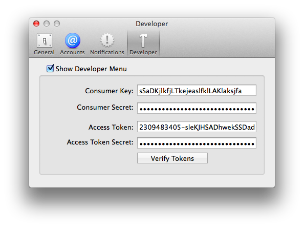
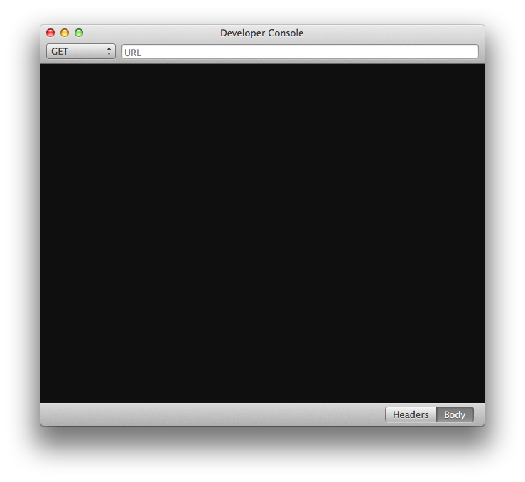

Note: this tutorial is written using Github Flavored Markdown (GFM) for clarity (and usefulness). It was originally authored by [@sylvaincarle](https://github.com/sylvaincarle) and has been edited and updated by [@wh1tney](http://www.github.com/wh1tney) (7/26/2014).

# Introduction to the Ruby Twitter API

A simple tutorial, providing code and context.

## Assumptions

* Ruby is installed and functional
* The twitter gem is ~ version 5.11.0
* You have [registered](https://dev.twitter.com/apps) your new app with Twitter

## Getting started

### Installing the Twitter Ruby Gem and calling the Twitter Rest API

First thing you need to do: install the [Twitter Ruby Gem](http://twitter.rubyforge.org/).

Then open your terminal and type:

    sudo gem install twitter

If everything works fine you will get a message after fetching and installing the gem is done. The latest version of this gem at the time of writing was twitter-5.11.0.

We will now create a simple file to get started. Create a file called twitter.rb with the following lines:

```ruby
require 'twitter'

client = Twitter::REST::Client.new do |config|
  config.consumer_key        = "YOUR_CONSUMER_KEY"
  config.consumer_secret     = "YOUR_CONSUMER_SECRET"
  config.access_token        = "YOUR_ACCESS_TOKEN"
  config.access_token_secret = "YOUR_ACCESS_SECRET"
end

puts client.status(167309659198328832).text
 ```
Save it (duh). When you excute twitter.rb, you will get the tweet with ID "167309659198328832" in your terminal output. It's a message from @twitterapi, check http://twitter.com/twitterapi/status/167309659198328832 to compare both. 

Now that we know that everything is working, let's move to the next level. We will explore the main concepts of the Twitter Rest API and of building Twitter applications.

<style "display:none">TODO: add troubleshooting tips</style>

## Understanding the main concepts

Twitter APIs (yes, there is more than one to account for different programming languages) are documented [here](https://dev.twitter.com/docs). That's a lot of material, but it might be difficult at first to piece together all the information you need, hence this more "procedural" tutorial. Once you walk through the steps here, you will have a better idea of what you should be searching for in all the available documentation.

#### Making a request (application-only)

Imagine you want to request a public user's list of tweets. You do not have to be signed in to accomplish this; that's what is meant by *application-only*.

All you need to do to request this data is call a few Ruby (or another language) methods; these methods construct a URL request, send it to the Twitter server, and pass back the results. Easy, right?

Note: You can accomplish all of this in the language of your choice, from JavaScript to Ruby. The choice is yours; there are interfaces to the Twitter API for [most popular languages](https://dev.twitter.com/docs/twitter-libraries).

#### Example API request

Here is an example that retrieves all of the most recent (fascinating) tweets by [@wjoba](http://twitter.com) using Ruby method calls.

```ruby
def collect_with_max_id(collection=[], max_id=nil, &block)
  response = block.call(max_id)
  collection += response
  response.empty? ? collection.flatten : collect_with_max_id(collection, response.last.id - 1, &block)
end

def client.get_all_tweets(user)
  collect_with_max_id do |max_id|
    options = {count: 50, include_rts: true}
    options[:max_id] = max_id unless max_id.nil?
    user_timeline(user, options)
  end
end

recent_tweets = client.get_all_tweets("wjoba")
```
Note that this method makes several calls to Twitter's [user_timeline](https://dev.twitter.com/docs/api/1.1/get/statuses/user_timeline) API method which has several option parameters that can be modified by adjusting the options hash passed in as an argument.
After we get these objects, we can do anything we want with the data packaged inside them. Maybe we just want to print the content of each tweet to the console.

```ruby
recent_tweets.each do |tweet|
	puts tweet.full_text
end
```

That's all there is to it.

### Notes

#### What is OAuth, how does it work?

Who cares? If you're a beginner, read a few lines on the [wikipedia page](http://en.wikipedia.org/wiki/Oauth) then don't worry about it for now. Learn more about it as you build it into your app.

#### Understanding the rate limitation

Twitter enforces a rate limit for third party apps which restricts the number of Twitter API requests that can be performed within the app for each user account. An API request can be thought of as a single Twitter operation, such as refreshing a timeline or sending a tweet.

**tl;dr** – don't send a bunch of requests in a short period of time.

#### Twitter for Mac Developer Console

Use the Developer Console that comes with the [Twitter for Mac](https://itunes.apple.com/us/app/twitter/id409789998?mt=12) app to test API calls (in the form of a fully-qualified URL).



